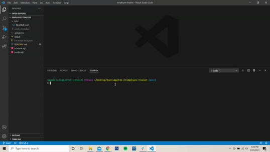

# Employee Tracker CLI

 ## **Description**
    
  This CLI app was created with the intention of assisting a user who wants to be able to manage employees. The app includes the capabilities of adding, editing, and viewing all employees, their roles, their salaries, and their managers. It communicates with a mySQL 
  
  ---
  
  ## Table of Contents  
  
  - [Description](#Description)  
  - [Installation](#Installation)
  - [Usage](#Usage)
  - [Contributions](#Contributions)
  
  ---
  
  ## **Installation**
  
  The user should install the following in their terminal in order for the application to run properly:  

  - npm install 
  - npm install mysql
  - npm install inquirer
  - npm install console.table
  
  ---
  
  ## **Usage**
  
  Upon installation, the user will open the application by entering 'node app.js' in the terminal. The application will then launch and the user is able to navigate through the appropriate menu to view, edit, and manage employees.

  Screenshot of demo file:  

  
  
  ---

  ## **Contributions**
  
  Thanks to help and advice from Austin Ruhf
  